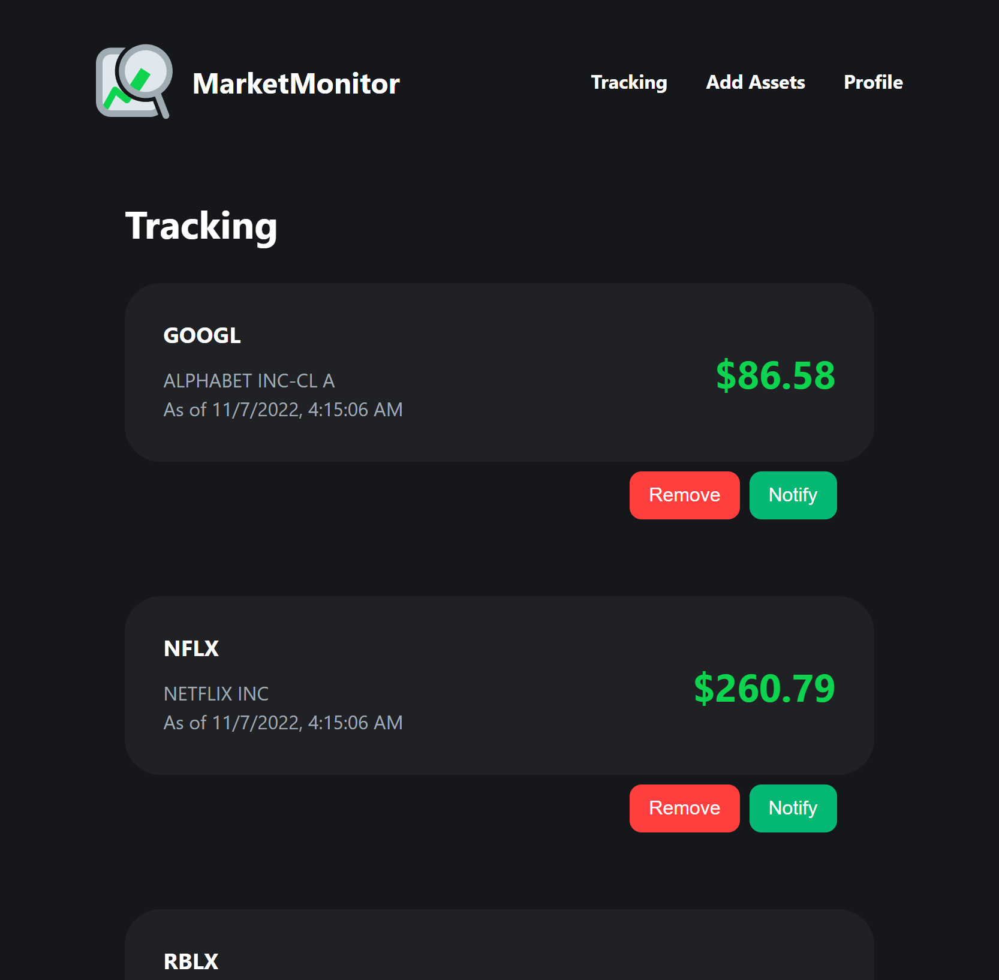

# MarketMonitor

A web and mobile applications to track prices of various financial securities in near real-time. This repo contains the Frontend web part of MarketMonitor.

## Starting project

First copy the `.env.example` file and rename it to `.env`. Replace the example base API url with whatever environment you're using. The example is set to be used for local environments already.

Run the development server by opening a console and doing `npm start`.

## Structure

Page components should go in `/src/pages`. Routing is handled in `/src/App.js`.

This project relies on [theme-ui](https://theme-ui.com/) to build the interface.

theme-ui comes with many reusable components that can be used on its own or to build your own custom reusable components. These new user-made components should go in `/src/components`.

Image assets and other media should go in `/src/assets`.

Other common/shared files should go in `/src/internals`.

Data fetching is handled by [swr](https://swr.vercel.app/).

